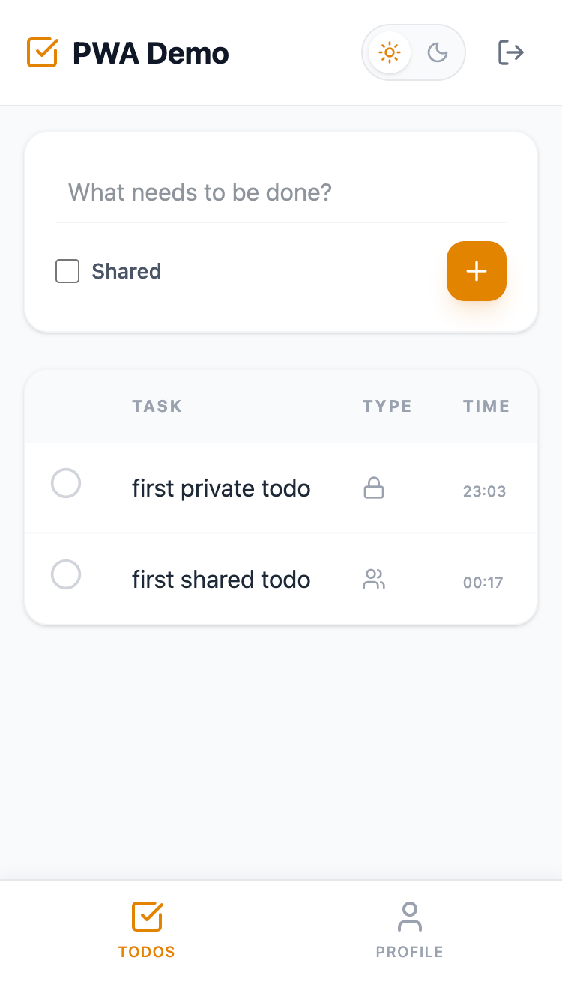
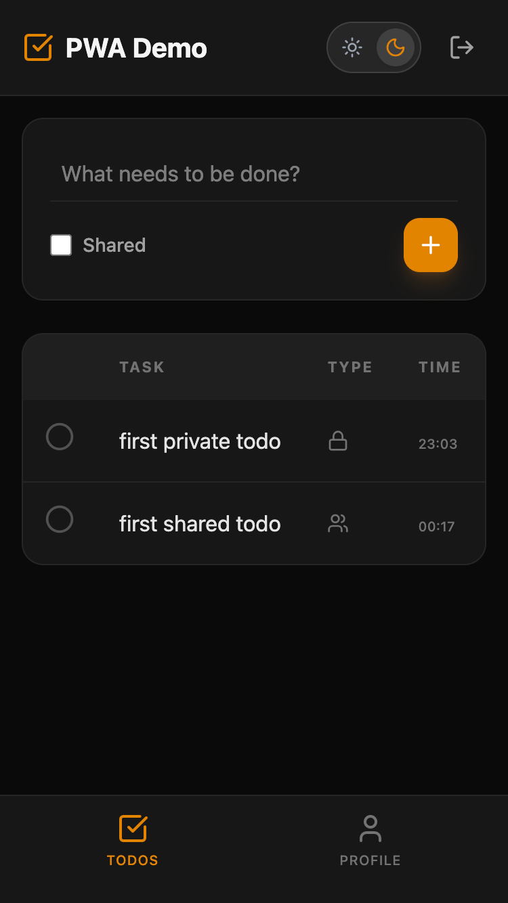

# 🚀 PWA Capabilities Demonstration App

> **🔗 [Try the Live Demo](http://pwa-demo-swart.vercel.app)**

[](https://vercel.com)
[](https://web.dev/progressive-web-apps/)

This project is a comprehensive **demonstration of Progressive Web App (PWA) capabilities**. It showcases how modern web technologies can replicate the performance, reliability, and feel of native mobile applications while remaining accessible through a simple URL.

The demo uses a simple **Todo Application** as a container to highlight the technical features.

---

### 📸 Screenshots

| Light Mode | Dark Mode |
| :---: | :---: |
|  |  |

---

## ⚡ Core PWA Features Demonstrated

### 1. 📲 Installable App Experience
* **Web App Manifest:** Configured for standalone mode, hiding browser UI to feel like a native app.
* **Splash Screen:** Custom icon and theme color configuration for a polished loading experience.

### 2. 🔌 Offline Capabilities
* **Service Workers:** Powered by Workbox, the application caches static assets (`App Shell`) for instant loading.
* **Data Persistence (Planned):** Currently, data requires an internet connection to sync. Offline data storage using IndexedDB is planned for future updates to enable full offline task management.

### 3. 🔄 Advanced Lifecycle Management
* **Custom "Update Available" Prompt:** Demonstrates detection of new server versions. Users are prompted to update rather than silently receiving breaking changes.
* **White Screen of Death Protection:** Implements error-handling scripts to manage cache invalidation seamlessly.

### 4. 🎨 Native-Like UI/UX
* **Adaptive Dark Mode:** System-aware theme switching.
* **Mobile-Optimized:** Designed for touch interactions with a bottom navigation bar (`thumb zone` design).
* **Custom Branding:** Branded color palette (`#e38400`) integrated into the UI components.

---

## 🛠️ Technical Stack

| Technology | Purpose |
| :--- | :--- |
| **React 19** | UI Library |
| **TypeScript** | Type Safety |
| **Vite** | Build Tool & PWA Plugin |
| **Tailwind CSS v4** | Modern CSS Framework |
| **Supabase** | Auth, Database, Realtime |
| **Vercel** | CI/CD & Hosting |

---

## 🚀 Getting Started

### Prerequisites
* Node.js (v18+)
* PNPM

### Installation

1.  Clone the repository:
    ```bash
    git clone [https://github.com/yourusername/pwa-demo.git](https://github.com/yourusername/pwa-demo.git)
    cd pwa-demo
    ```

2.  Install dependencies:
    ```bash
    pnpm install
    ```

3.  Set up environment variables:
    Create a `.env` file in the root directory and add your Supabase credentials:
    ```env
    VITE_SUPABASE_URL=your_supabase_url
    VITE_SUPABASE_ANON_KEY=your_supabase_anon_key
    ```

4.  Run the development server:
    ```bash
    pnpm dev
    ```

---

## 🛠️ Key PWA Configuration (`vite.config.ts`)

The PWA capabilities are configured using `vite-plugin-pwa`:

```typescript
// Example configuration snippet
VitePWA({
  registerType: 'prompt', // Controls update behavior
  workbox: {
    cleanupOutdatedCaches: true,
    globPatterns: ['**/*.{js,css,html,ico,png,svg,webmanifest}'],
  },
  // ... manifest config
})
```
